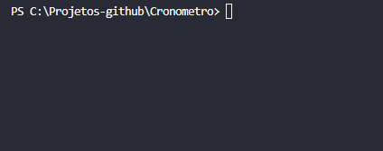

<h1 align="center">Cronômetro ⏳</h1>

  

## :books: Informações
Primeira versão do meu projeto "Cronômetro em C#", o qual a aula foi orientada pelo Andre Baltieri. Neste projeto foi utilizado várias funções, como:
- Uso do "ToLower()"
- Uso do "Substring"
- Pegar apenas partes de valores e converter para algo
- Utilização do "Thread.Sleep"
- Uso do "While"

## :pushpin: Tecnologias
<ul>
  <li><a href="https://docs.microsoft.com/pt-br/dotnet/csharp/programming-guide/">C#</a></li>
</ul>
